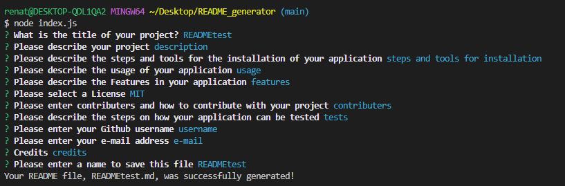

# README file generator
  
  [](https://opensource.org/licenses/MIT)

  ## Description
  This application enables the user to answer questions and a README file will be automatically generated.
  
  Please see complete demo video at: https://drive.google.com/file/d/1zOLFQvinVXkKiJr3lUwfdq9r-zXNkjO8/view

  

  ## Table of Contents
  - [Installation](#installation)
  - [Usage](#usage)
  - [Features](#features)
  - [License](#license)
  - [Contributing](#contributing)
  - [Tests](#tests)
  - [Questions](#questions)
  - [Credits](#credits)
  
  ## Installation
  1.  This application requires the installation of inquirer. Please go to the terminal and type in the following: 

  ````java 
  npm i inquirer@8.2.4 
  ````
  This command will download the "node_modules".

  2. Once downloaded, please type in the below to start the application:

   ````java 
  node index.js
  ````

  ## Usage
  The user will answer 12 questions and once the final question is answered, a README file will be automatically generated. Please see the following questions:

  

  ## Features
  1. README file is generated with a professional structure.
  2. Table of contents is automatically generated 
  3. License links and badges are added once a license is selected.

  ## License
  [](https://opensource.org/licenses/MIT)
  
  This application is covered by MIT license, available at:
  https://opensource.org/licenses/MIT

  ## Contributing
  Please feel free to send a pull request, the following is my GitHub account: https://github.com/Renatatims

  ## Tests
  Please make sure the inquirer is installed. Once the node_modules are downloaded, then you can run the application by typing 'node index.js' in the terminal and the user will be prompt with 12 questions.
  Please check the folder "tests" to check two README sample files generated using this application.

  ## Questions
  If you have any questions please contact me at:
   - GitHub account: https://github.com/Renatatims
   - e-mail account: @gmail.com

  ## Credits
  Sources: 
   - The Full-Stack Blog - Professional README guide: "https://coding-boot-camp.github.io/full-stack/github/professional-readme-guide", 
   - Open Source: "https://opensource.org/licenses", 
   - Mozilla: "https://developer.mozilla.org/en-US/docs/Web/JavaScript/Reference/Statements/async_function"
   - Shields: https://shields.io/category/license
 
